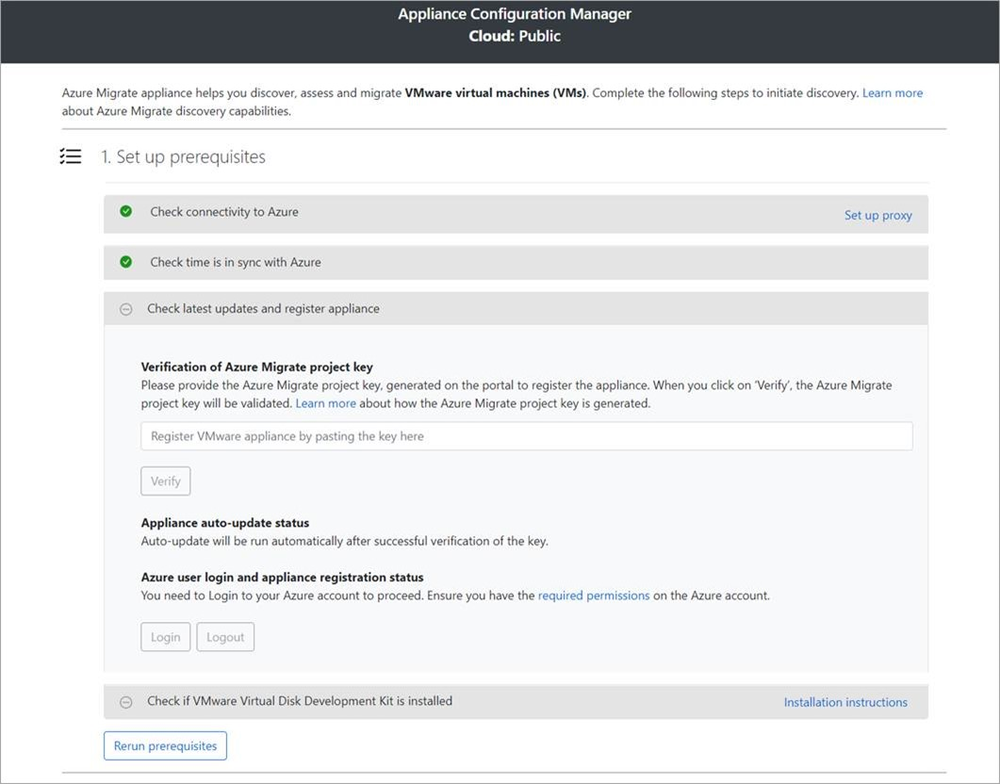
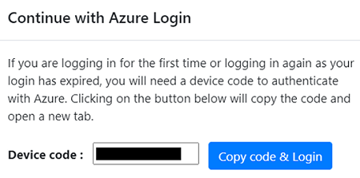

# AZURE MIGRATE APPLIANCE SETUP/CONFIGURATION

*Authored by:*

*Shane Neff*

*Senior Cloud Solution Architect- Microsoft*

*6/29/2022*

---

## AZURE MIGRATE OVERVIEW

Azure Migrate provides a central hub to track discovery, assessment, and migration of your on-premises apps and workloads and private and public cloud VMs to Azure. The hub provides Azure Migrate tools for assessment and migration and third-party ISV offerings

The [Azure Migrate](https://docs.microsoft.com/en-us/azure/migrate/migrate-services-overview) service....

Azure Migrate: [Discovery and assessment tool](https://docs.microsoft.com/en-us/azure/migrate/migrate-services-overview#azure-migrate-discovery-and-assessment-tool)

- Azure readiness: Assesses whether on-premises servers are ready for migration to Azure
- Azure sizing: Estimates the size of Azure VMs
- Azure cost estimation: Estimates costs for running on-premises servers in Azure.
- Dependency analysis: Identifies cross-server dependencies and optimization strategies for moving interdependent servers to Azure

To enable server migrations

---

## AZURE MIGRATE APPLIANCE OVERVIEW

Discovery and assessment use a lightweight Azure Migrate appliance that you deploy on-premises

- The appliance runs on a VM or physical server that is deployed at the customers location
- The appliance discovers on-premises servers (as well as application and data services where applicable). 
- Provides VM server metadata and performance data to the Azure Migrate service deployed in the customer's Azure tenant
- Appliance discovery is agentless. Nothing is installed on discovered servers 

---

## AZURE MIGRATE ARCHITECTURE

[Azure Migrate Agentless architecture](https://docs.microsoft.com/en-us/azure/migrate/prepare-for-agentless-migration)

---

## AZURE MIGRATE: SERVER MIGRATION TOOL

The Azure Migrate: [Server Migration tool](https://docs.microsoft.com/en-us/azure/migrate/migrate-services-overview#azure-migrate-server-migration-tool) helps in accessing and migrating servers (virtual or physical) to Azure

- On-premises VMware VMs: Migrate VMs to Azure using agentless or agent-based migration
     - For agentless migration, Server Migration uses the same appliance that is used by Discovery and assessment tool for discovery and assessment of servers

---

## Azure Migrate appliance System Requirements
 

## VMware Requirements

The following are the vCenter requirements:

- vCenter Server running 5.5, 6.0, 6.5, 6.7 or 7.0 
- ESXi host running version 5.5 or later

## Deply Azure Migrate Appliance

[Azure Migrate appliance System Requirements](https://docs.microsoft.com/en-us/azure/migrate/migrate-appliance)

The appliance will be deployed as new VM on a vCenter Server using OVA template. The following are the steps to take in order to provision and configure the Azure Migrate appliance

- Download VM Agent Installer: https://go.microsoft.com/fwlink/?LinkID=394789
- In the vSphere Client console, select File > Deploy OVF Template
- In the Deploy OVF Template Wizard, select Source, and then enter the location of the OVA file
- In Name, enter a name for the server
- In Location, select the inventory object in which the server will be hosted
- In Host/Cluster, select the host or cluster on which the server will run
- In Storage, select the storage destination for the server
- In Disk Format, select the disk type and size
- In Network Mapping, select the network the server will connect to 
- The network requires internet connectivity to send metadata to Azure Migrate as well as other outbound network requirements (see network requirements in the next section for details)
- Review and confirm the settings, and then select Finish
- Verify appliance access to Azure
- Make sure that the appliance server can connect to the Azure URLs referenced in the following section

## Configure Azure Migrate Appliance

- In vSphere Client, right-click the server, and then select Open Console
- Select or enter the language, time zone, and password for the appliance
- Open a browser on any server that can connect to the appliance server
- Open the URL of the appliance configuration manager: https://appliance name or IP address: 44368
- Accept the license terms and read the third-party information

## Register the appliance

- In the configuration manager, select Set up prerequisites, and then complete these steps:
- Connectivity: The appliance checks that the server has internet access
- If the server will connect the the Azure URLs uses a proxy follow these steps:
    - Select Setup proxy to specify the proxy address (in the form http://ProxyIPAddress or http://ProxyFQDN, where FQDN refers to a fully qualified domain name) and listening port
    - Enter credentials if the proxy needs authentication
    - If you have added proxy details or disabled the proxy or authentication, select Save to trigger connectivity and check connectivity again
    - ***Only HTTP proxy is supported***
    - Time sync: Check that the time on the appliance is in sync with internet time for discovery to work properly
    - Install updates and register appliance: To run auto-update and register the appliance

Example:

- For the appliance to run auto-update, paste the project key that you copied from the portal. If you don't have the key, go to Azure Migrate: Discovery and assessment > Overview > Manage existing appliances. Select the appliance name you provided when you generated the project key, and then copy the key that's shown
- The appliance will verify the key and start the auto-update service, which updates all the services on the appliance to their latest versions. When the auto-update has run, you can select View appliance services to see the status and versions of the services running on the appliance server
- To register the appliance, you need to select Login. In Continue with Azure Login, select Copy code & Login to copy the device code (you must have a device code to authenticate with Azure) and open an Azure Login prompt in a new browser tab. Make sure you've disabled the pop-up blocker in the browser to see the prompt

- In a new tab in your browser, paste the device code and sign in by using your Azure username and password
    - Signing in with a PIN isn't supported
    - If you close the login tab accidentally without logging in, refresh the browser tab of the appliance configuration manager to display the device code and Copy code & Login button
- After you successfully log in, return to the browser tab that displays the appliance configuration manager. If the Azure user account that you used to log in has the required permissions for the Azure resources that were created during key generation, appliance registration starts
- Install the VDDK: The appliance checks that VMware vSphere Virtual Disk Development Kit (VDDK) is installed. If the VDDK isn't installed, download VDDK 6.7 from VMware. Extract the downloaded zip file contents to the specified location on the appliance, as indicated in the Installation instructions
    - Azure Migrate Server Migration uses the VDDK to replicate servers during migration to Azure
    - You can rerun prerequisites at any time during appliance configuration to check whether the appliance meets all the prerequisites
- Start continuous discovery
    - Complete the setup steps in the appliance configuration manager to prepare for and start discovery.

---

## NETWORK REQUIREMENTS

The Azure Migrate appliance needs connectivity to the internet.

When you deploy the appliance, Azure Migrate does a connectivity check to the required URLs.
You need to allow access to all URLs in the list. If you're doing assessment only, you can skip the URLs that are marked as required for VMware agentless migration.
If you're using a URL-based proxy to connect to the internet, make sure that the proxy resolves any CNAME records received while looking up the URLs

| URL                                                                                                                                                                                	| Details                                                                                              	|
|------------------------------------------------------------------------------------------------------------------------------------------------------------------------------------	|------------------------------------------------------------------------------------------------------	|
| *.portal.azure.com                                                                                                                                                                 	| Navigate to the Azure portal.                                                                        	|
| *.windows.net *.msftauth.net *.msauth.net *.microsoft.com *.live.com *.office.com *.microsoftonline.com *.microsoftonline-p.com *.microsoftazuread-sso.com 	| Used for access control and identity management by Azure Active Directory                            	|
| management.azure.com                                                                                                                                                               	| Used for resource deployments and management operations                                              	|
| *.services.visualstudio.com                                                                                                                                                        	| Upload appliance logs used for internal monitoring.                                                  	|
| *.vault.azure.net                                                                                                                                                                  	| Manage secrets in the Azure Key Vault. Note: Ensure servers to replicate have access to this.     	|
| aka.ms/*                                                                                                                                                                           	| Allow access to these links; used to download and install the latest updates for appliance services. 	|
| download.microsoft.com/download                                                                                                                                                    	| Allow downloads from Microsoft download center.                                                      	|
| *.servicebus.windows.net                                                                                                                                                           	| Communication between the appliance and the Azure Migrate service.                                   	|
| *.discoverysrv.windowsazure.com *.migration.windowsazure.com                                                                                                                    	| Connect to Azure Migrate service URLs.                                                               	|
| *.hypervrecoverymanager.windowsazure.com                                                                                                                                           	| Used for VMware agentless migration  Connect to Azure Migrate service URLs.                    	|
| *.blob.core.windows.net                                                                                                                                                            	| Used for VMware agentless migration  Upload data to storage for migration.                     	|

---

---

### Start continuous discovery

Complete the setup steps in the appliance configuration manager to prepare for and start discovery

### Provide server credentials

---

### Start discovery

---

### Provide vCenter Server details
The appliance must connect to vCenter Server to discover the configuration and performance data of the servers:

---

## AZURE CONFIGURATION

To support HA/DR requirements, this solution will leverage [Region Pairs](https://docs.microsoft.com/en-gb/azure/availability-zones/cross-region-replication-azure#azure-cross-region-replication-pairings-for-all-geographies)

Region selection: West Europe- it is a region pair B and it's paired region is Northern Europe, which is located in Northern Ireland

